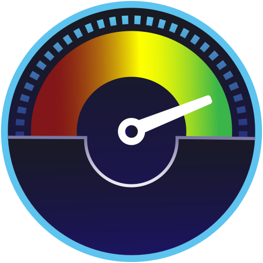

<p align="center">
    
</p>

<h1 align="center">Stacer-X</h1>

<h3 align="center">A modern, Fluent-style reimagining of the Stacer Linux optimizer</h3>

<p align="center">
    
    
    
</p>

---

**Stacer-X** is a fork of [QuentiumYT/Stacer](https://github.com/QuentiumYT/Stacer) that
rewrites the entire front-end in **Qt Quick / QML**, styled after **Microsoft PC Manager**
(Fluent dark). The proven `stacer-core` C++ backend is reused unchanged — every number you
see still comes from the original system probes — but the interface is rebuilt from scratch:
a frameless, fixed-size window with an icon-only navigation rail, live charts, and custom
branding.

> The original Qt Widgets app still builds as the `stacer` target. The new QML interface is
> a separate `stacer-x` target — the two share `stacer-core` but are otherwise independent.

## Highlights

- **Dashboard** — live CPU / memory, per-core load, uptime, and a **System Boost** that frees
  reclaimable memory and tells you exactly how much it reclaimed. A dynamic status banner reads
  current load and offers a one-click fix (free memory, or jump to the Cleaner).
- **Cleaner** — scans cache, trash, package caches, logs and crash reports, with a **Details**
  preview so you can see exactly what will be deleted before cleaning.
- **Services** — start/stop/enable/disable systemd units, with live search.
- **Processes** — sortable list with search, renice (priority), and kill.
- **Startup** — manage `~/.config/autostart` entries.
- **Uninstaller** — remove packages, with optional **leftover config removal**
  (`~/.config`, `~/.cache`, `~/.local/...`) and **autoremove** of orphaned dependencies.
- **Hosts** — edit `/etc/hosts` entries (toggle / add / remove).
- **Resources** — live charts for CPU, integrated GPU, **NVIDIA GPU** (via `nvidia-smi`),
  memory, disk I/O and network throughput.
- **Disk** — per-partition usage as a donut chart with a legend.
- **Settings** — resource-usage alerts (CPU / memory / disk thresholds, persisted), start on
  login, accent colour.
- Frameless fixed-size window, custom logo, and desktop launcher / dock integration.

## Build from Source

### Prerequisites

Qt 6 with the Quick / QML modules, plus CMake and Ninja.

**Fedora:**
```bash
sudo dnf install cmake ninja-build gcc-c++ \
  qt6-qtbase-devel qt6-qtdeclarative-devel qt6-qt5compat-devel \
  qt6-qtsvg-devel
```

**Debian / Ubuntu:**
```bash
sudo apt update
sudo apt install cmake ninja-build g++ \
  qt6-base-dev qt6-declarative-dev qt6-declarative-private-dev \
  libqt6core5compat6-dev libqt6svg6-dev qml6-module-* 
```

### Compile & run

```bash
cmake -S . -B build -G Ninja
cmake --build build --target stacer-x -j $(nproc)
./build/stacer-qml/stacer-x
```

Privileged actions (System Boost, cleaning system paths, editing `/etc/hosts`, removing
packages) are elevated through **polkit** (`pkexec`) at the moment they run — Stacer-X itself
runs as your normal user.

## Project layout

```
stacer-core/   Backend — system probes & tools (shared, unchanged from upstream Stacer)
stacer/        Original Qt Widgets app (target: stacer)
stacer-qml/    Stacer-X — the Qt Quick / QML front-end (target: stacer-x)
  *.{h,cpp}      Controllers bridging stacer-core to QML (context properties)
  qml/           Theme, reusable components, and pages
  qml/icons/     Monochrome SVG icons, recoloured at runtime
icon/          Source icon set
stacer-logo.svg  Application logo / branding
```

## Credits

Stacer-X builds on **[Stacer](https://github.com/QuentiumYT/Stacer)** by Quentin Lienhardt
(QuentiumYT), itself originally created by Oguzhan Inan. All backend system logic comes from
that project. Stacer-X contributes the QML/Fluent front-end and the additional UX around the
existing tools.

The UI design takes visual inspiration from **Microsoft PC Manager**.

## License

Same license as upstream Stacer — see [LICENSE](LICENSE).
